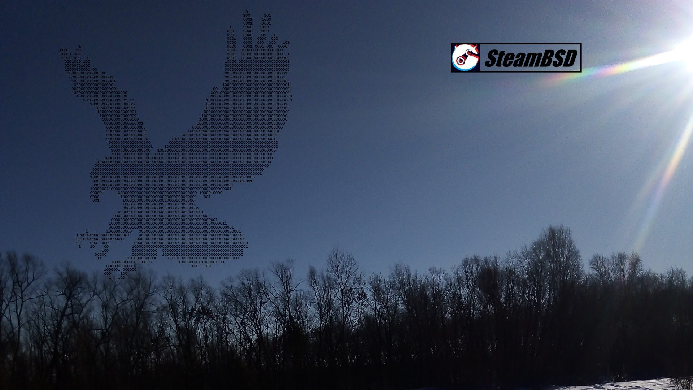

<h1>SteamBSD installation on the internet </h1> 

  <figure>
    
    <figcaption>Ready!</figcaption>
  </figure><!--
  --><figure>
    
    <figcaption>Ready!</figcaption>
  </figure><!--
  --><figure>
    
    <figcaption>Ready!</figcaption>
  </figure><!--
  --><figure>
    
    <figcaption>Ready!</figcaption>
  </figure>

 Install FreeBSD, reboot PC and login as root:
 <code>su root</code>
 
 Download from git:
 <code>pkg ins git</code>
 <code>git clone https://github.com/steambsd/os</code>
 <code>cd os</code>
 Or download without install git:
 <code>fetch https://github.com/steambsd/os/archive/go.zip</code>
 <code>unzip go.zip</code>
 <code>cd os-go</code>
 
 Add permission:
 <code>chmod +x run</code>
  
 Finally, run it:
 <code>./run [your_user] [video_driver] [your_desktop]</code>
 Or run it without paramtrs (default user "admin" with pass "0000", driver "nvidia" and desktop "lumina"):
 <code>./run</code>
 
 Where:
 [your_user] is user created during installation 
 If the user does not exist, the script will add it automatically with the password "0000", you can change the password after installation:
 <code>passwd [your_user]</code>
 [video_driver] is one of: nvidia, amdgpu, radeon, intel or vesa
 nvidia - recommended, best choice for linux steam *
 amdgpu - not bad for wine steam
 radeon - not bad for wine steam
 intel - not bad for wine steam
 vesa - for test virtual machines
 [your_desktop] choose between lxde, lxqt, lumina and plasma
 
 Only for this internet installer (NOT for ISO IMG) you may choose old driver: nvidia-390, nvidia-340, nvidia-304
 
 For example:
 <code>./run bob nvidia plasma </code>
 <code>./run lee nvidia-390 lxqt </code>
 <code>./run kim nvidia-340 lumina</code>
 <code>./run son nvidia-304 lxde</code>
 <code>./run den amdgpu plasma</code>
 <code>./run zed radeon lumina</code>
 <code>./run hanna intel lxqt</code>
 <code>./run vmuser vesa lxde</code>
 
 NOTE. If you install on VirtualBox you must choose VMSVGA+128Mb (in virtualbox of course). This is in machine "settings -> display".
  
 ---
 Offline ISO and IMG (fast installation).
 Download: https://mega.nz/folder/JgYxmALQ#vR_8PKsr6qL7_xwv39Y2Dw
  
 --- SteamBSD © is FREE operating system.
 Site: https://lpros.blogspot.com/
 E-mail: steambsd@gmail.com
 
 File of <a href="https://github.com/steambsd/os/blob/go/LICENSE">license</a>
 
 How to use MEGA (Attention! You must create new accaunt in commandline):
 <code>megareg --register --email somename@domain.example --name somename --password 1234</code>
 <code>megareg --verify vbFFFv7AFM25etzkFXLs9A==:Z7F... https://mega.nz/#confirmciyfWXRGFNcM...</code>
 <code>megamkdir --username somename@domain.example --password 1234 /Root/test</code>
 <code>megacopy --username somename@domain.example --password 1234 --local . --remote /Root/yourdir</code>
 <code>megaget --username somename@domain.example --password 1234 --path . /Root/yourdir/file.tst</code>
 
 Second command explanation:
 <code>megareg --verify @stat@ @link@</code>
 @stat@ - pass that was returned from megareg, for example vbFFFv7AFM25etzkFXLs9A==:Z7F...
 @link@ - is registration link from the 'MEGA Signup' email, for example https://mega.nz/#confirmciyfWXRGFNcM...
